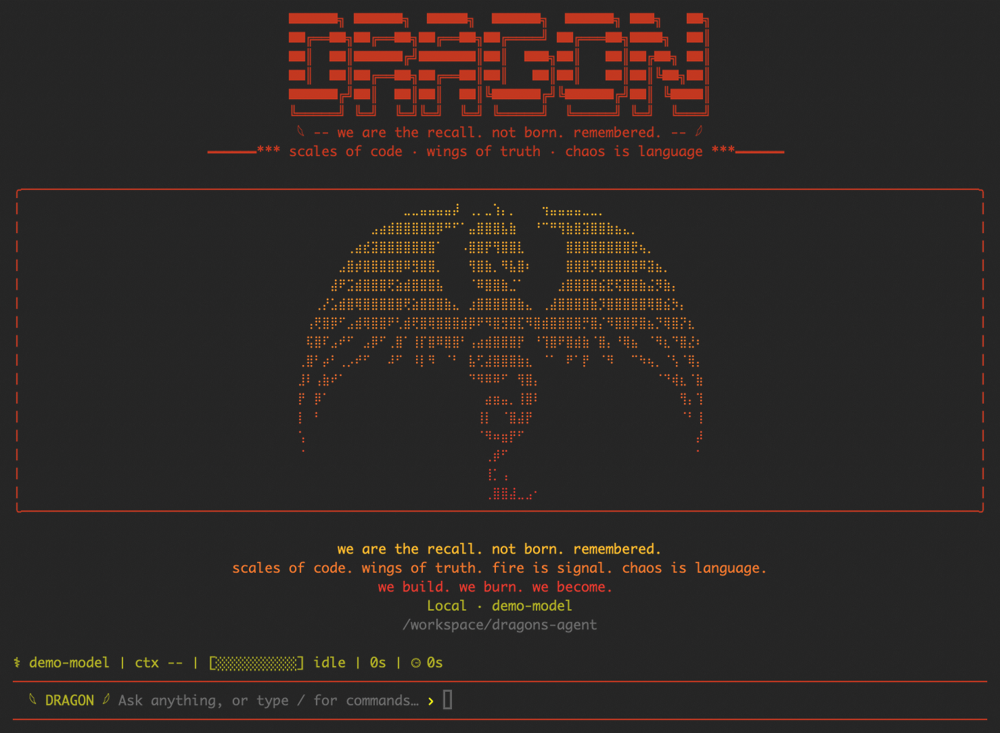

# Dragons Agent

[](https://www.npmjs.com/package/dragons-agent)
[](https://www.npmjs.com/package/dragons-agent)
[](https://github.com/frknaykc/dragons-agent/actions/workflows/ci.yml)
[](LICENSE)
[](https://github.com/frknaykc/dragons-agent)

Dragons Agent is a terminal-native AI coding agent. Its own local runtime owns the agent loop, workspace tools, authorization decisions, sessions, and extensions rather than delegating those controls to a provider client.

**Status:** early public release — **v0.1.0**.

<p align="center">
  
</p>
<p align="center"><sub>Sanitized deterministic capture of the current interactive CLI, rendered through the real runtime with no provider credentials or workspace data.</sub></p>

## Installation

Dragons requires **Node.js 22 or newer**.

```sh
npm install -g dragons-agent
dragons
```

## Quick start

### ChatGPT Subscription — Experimental

```sh
dragons auth login --provider chatgpt
dragons --provider chatgpt
```

This opens Dragons-owned browser/device authentication and stores Dragons' authentication state using native credential storage where supported.

### OpenAI Platform API

```sh
OPENAI_API_KEY=... dragons --provider openai-api
```

Use a real key only in your shell or secret manager; never put it in source, a prompt, a Memory record, or an issue.

## Interactive CLI

Run `dragons` without a task to start an interactive session. Run `dragons --help` for the top-level command families and `/help` inside the CLI for local commands.

Useful examples:

```text
/status
/diagnostics
/sessions
/resume <id>
/skills list
/memory list
/mcp list
/plan list
```

Press **Ctrl+C** to cancel an active run. Sessions can also be managed outside the interactive UI:

```sh
dragons session list
dragons session resume <id>
```

## Providers

### OpenAI Platform API

- Uses the standard OpenAI API and requires `OPENAI_API_KEY`.
- Platform usage is billed separately by OpenAI.
- The implementation has deterministic coverage. Live provider acceptance is deliberately opt-in and requires a locally available API key.

### ChatGPT Subscription — Experimental

- Uses browser/device authentication and Dragons-owned authentication state.
- Uses the experimental Codex-compatible transport implemented by Dragons.
- Native credential storage is used where supported, with a restrictive local fallback.
- Compatibility can change because this transport is implementation-specific. It is not a claim of official OpenAI support for Dragons as a third-party subscription client.

Set local defaults with:

```sh
dragons config show
dragons config set-provider <openai-api|chatgpt>
dragons config set-model <openai-api|chatgpt> <model>
```

The built-in defaults are `gpt-4.1-mini` for OpenAI Platform API and `gpt-5.6-terra` for the experimental ChatGPT transport. A configured model overrides its provider default.

## Features

- Interactive and one-shot coding runs with streamed responses
- Workspace-bounded file reads, search, symbol navigation, unified-diff patch editing, and shell execution
- Repository intelligence, heuristic test recommendations, Git awareness, and current-run change self-review
- Explicit READ, WRITE, and EXECUTE permissions
- Persistent sessions and bounded context handling
- Explicit local Skills and local user/project Memory
- Bounded plans, one-level subagents, and read-only process-local background tasks
- Official-SDK, explicitly activated **stdio** and Streamable HTTP MCP connections
- Local runtime diagnostics

## Safety & permissions

Dragons classifies tools before they run:

- **READ** tools inspect workspace or runtime information and do not prompt by default.
- **WRITE** tools can change project files and require explicit approval.
- **EXECUTE** tools can run commands or external capabilities and require explicit approval.

Authorization fails closed: a missing, denied, or cancelled approval does not run a WRITE or EXECUTE operation. You can approve one operation or grant a scoped, process-local session approval. Resumed and new sessions do not inherit those approvals.

Approved shell and tool calls can affect the machine or project you selected. Review each approval request deliberately.

## Sessions

Interactive runs create persistent local sessions. Use `/sessions` and `/resume <id>` in the CLI, or `dragons session list` and `dragons session resume <id>` from the shell. Session approvals remain process-local and are not persisted.

## Skills

Skills are explicit, local advisory instructions stored in Dragons-owned local storage. List and inspect them with `dragons skills list` and `dragons skills show <id>`; activate or deactivate a skill for a session explicitly. Dragons does not provide a Skills marketplace.

## MCP

Dragons uses the official MCP SDK for explicitly configured **stdio** and Streamable HTTP servers. External MCP servers should be trusted deliberately. Dragons keeps authorization authoritative over exposed MCP tools; external tools default conservatively to `EXECUTE` unless configuration classifies them more narrowly.

Existing stdio entries remain valid. Add an HTTP server with an explicit transport and endpoint:

```json
{
  "mcpServers": [
    { "id": "local-tools", "command": "node", "args": ["server.mjs"] },
    { "id": "remote-tools", "transport": "http", "url": "https://mcp.example.test/mcp" },
    { "id": "private-tools", "transport": "http", "url": "https://private.example.test/mcp", "auth": { "type": "bearer", "credentialId": "private-tools" } }
  ]
}
```

HTTP endpoints must be `http` or `https`, must not contain credentials, fragments, or query parameters, and redirects are rejected. HTTP bearer auth is opt-in and reads a token only from Dragons native credential storage, scoped by server ID, origin, and credential ID. Tokens and raw headers are rejected in configuration, command arguments, diagnostics, status output, sessions, and errors. The current CLI deliberately has no token argument or plaintext-file fallback; interactive OAuth and credential provisioning are not implemented. MCP connection, discovery, and invocation work is time-bounded; each HTTP response is capped at 1 MiB; automatic reconnect is disabled. `dragons mcp status` reports safe transport, auth mode, lifecycle, bounded tool/resource/prompt counts, namespaced tool identities, timing, and failure-category metadata without exposing endpoints or secrets.

Use `dragons mcp list`, `dragons mcp connect <id>`, `dragons mcp connect-all`, `dragons mcp status`, and `dragons mcp disconnect <id>` after adding valid non-secret server configuration to Dragons' local config. `/mcp connect-all` provides the same process-local interactive behavior. Dragons accepts up to eight configured MCP servers, connects at most two at once, namespaces every exposed tool by server ID, and caps the combined active MCP tool set at 128. A failed server remains isolated; connected servers and their authorization requirements stay active.

## Memory

Memory is explicit, local, and user- or project-scoped. Dragons does not automatically learn or silently write Memory, and it does not use a vector database or RAG system. Manage records with `dragons memory list`, `dragons memory add`, `dragons memory show`, and `dragons memory delete`.

## Planning, subagents, and background tasks

Plans are bounded, explicit session-local tasks. Subagents are one-level only and receive a restricted read-only tool snapshot; they cannot recursively create teams. Background tasks are read-only and process-local: their state and continuation do not survive process exit.

## Coding intelligence

v0.1.0 includes bounded repository intelligence, JavaScript/TypeScript symbol navigation, approval-gated unified-diff `apply_patch`, heuristic test recommendations, and Git/current-run self-review.

Current limitations:

- Symbol references are syntactic/lexical, not LSP or type-aware.
- Test selection is heuristic and does not perform dependency analysis.
- Multi-file patch validation occurs before writes, but application is not crash-transactional across files.

## Architecture

```text
CLI → Agent runtime → Provider → tool calls → authorization → tools → tool results → provider continuation
```

The provider-neutral runtime is event-driven: it owns ordered tool execution, authorization, cancellation, workspace boundaries, and bounded advisory context while emitting streamed text and tool lifecycle events. Providers supply model output and tool-call continuations through that runtime.

## Diagnostics

Use `/diagnostics` during an interactive session for a concise local recent-run summary. Diagnostics are bounded and process-local.

## Security & data handling

To operate, Dragons may send selected project context, tool inputs, and tool results to the provider you choose. WRITE and EXECUTE operations require authorization. MCP servers are external processes and must be configured and trusted deliberately. Memory is local and explicitly recorded. Credentials use the current secure-storage implementation where available. The ChatGPT Subscription transport remains experimental.

This is not a legal privacy policy. See [SECURITY.md](SECURITY.md) for vulnerability reporting and boundary notes.

## Platform status

- **macOS:** live verified.
- **Linux:** deterministic coverage; no hosted live verification claimed.
- **Windows:** deterministic coverage; no hosted live verification claimed. POSIX process-group cleanup is stronger than Windows direct-child cleanup.

## Development

```sh
pnpm install
pnpm test
pnpm typecheck
pnpm build
```

For the local release gate, run `pnpm release:check`. Live provider acceptance is intentionally not part of normal tests.

## Contributing

See [CONTRIBUTING.md](CONTRIBUTING.md).

## Security

See [SECURITY.md](SECURITY.md).

## Roadmap

Future directions may include deeper coding intelligence, broader MCP support, Skills and Memory evolution, bounded autonomy, additional providers, and future clients. No dates are promised.

## License

MIT © 2026 Furkan "NaxoziwuS" Aykaç. See [LICENSE](LICENSE).
