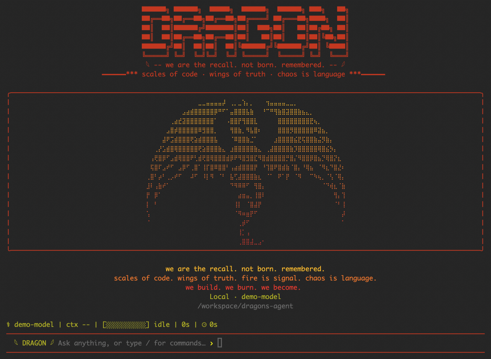

# Dragons Agent

<p align="center">
  
</p>

[](https://www.npmjs.com/package/dragons-agent)
[](https://www.npmjs.com/package/dragons-agent)
[](https://github.com/frknaykc/dragons-agent/actions/workflows/ci.yml)
[](LICENSE)

An AI coding agent for your terminal, with a desktop client. Read and edit code, run commands, and continue work across sessions with explicit approval for file changes and execution.

**Status:** early public release, v0.1.0. CLI and Desktop are the current priorities; an optional full-screen TUI is also available. Desktop packages remain development builds, not signed public installers.

<p align="center">
  
</p>

## Install

Requires **Node.js 22+**.

```sh
npm install -g dragons-agent
dragons
```

Ask in CLI or Desktop: “Find the session where we discussed the database migration, then read the relevant history.” Session search is restricted to the active profile and workspace. Known credential fields (including quoted cookie and ID-token fields) are redacted from tool observations and historical read/search projections. Runtime approval decisions, including nested LSP denials, are excluded from new durable tool observations without removing useful write results or approved diagnostics; see [search scope and limits](docs/advanced-usage.md#session-search).

For large tool catalogs, the model can call `tool_search` to find capabilities and `tool_describe` to load selected schemas before use. Core coding tools remain available; discovering a tool does not approve writes or execution. See [dynamic tool search](docs/advanced-usage.md#dynamic-tool-search).

CLI and Desktop also expose `execute_program` for bounded JSON steps: call tools, filter arrays, loop over items and aggregate results without a new model turn per item. It is a declarative interpreter, **not** JavaScript execution or an OS sandbox. Every nested tool call retains the same `runAgent()` authorization (including WRITE/EXECUTE approval), cancellation, visibility and run limits. See [programmatic tool execution](docs/advanced-usage.md#programmatic-tool-execution).

## Quick start

### ChatGPT subscription (experimental)

```sh
dragons auth login --provider chatgpt
dragons --provider chatgpt
```

Sign in through the browser/device flow. This integration is experimental and is not an officially supported OpenAI third-party subscription client.

### API providers

```sh
dragons auth login --provider openai-api
dragons --provider openai-api
```

Enter your API key in the masked local prompt, never in chat. API-key login requires native credential storage. Provider API usage is billed separately.

| Provider | Provider ID | Environment alternative |
| --- | --- | --- |
| OpenAI | `openai-api` | `OPENAI_API_KEY` |
| Anthropic | `anthropic` | `ANTHROPIC_API_KEY` |
| Google Gemini | `gemini` | `GEMINI_API_KEY` |
| OpenRouter | `openrouter` | `OPENROUTER_API_KEY` |

Choose a model and save your defaults:

```sh
dragons config set-provider openai-api
dragons config set-model openai-api <model-id>
```

Available models depend on your provider account. Use `--model <model-id>` to override the default for a run.

### Local models

Connect to an already-running OpenAI-compatible server, such as Ollama or vLLM:

```sh
dragons config set-local-endpoint http://127.0.0.1:11434/v1
dragons config set-model local qwen2.5-coder:7b
dragons --provider local
```

Install the model separately and choose one with tool-calling support. Plain HTTP is limited to literal loopback addresses; the Local adapter does not send API credentials.

## Everyday use

Interactive CLI: `/worktree create <name>` creates a clean sibling worktree and opens a new session there; `/worktree select <name>` switches to an existing managed sibling. Uncommitted source changes remain in the original workspace. Desktop shows the target folder, which must be reopened to switch. See [isolated worktrees](docs/advanced-usage.md#isolated-git-worktrees).

Run `dragons` for an interactive session, or pass a task directly:

```sh
dragons "Explain how this project is structured"
```

Attach selected context with `@file(src/index.ts)`, `@folder(src)`, `@diff`, or `@url(https://www.wikipedia.org/)`. URL requests require separate network approval. See [syntax and limits](docs/advanced-usage.md#inline-context-references).

Type `/` to browse commands. Use **Up/Down** to choose, **Tab** or **Enter** to insert, then **Enter** to submit. Press **Ctrl+C** to cancel an active run.

| Command | Purpose |
| --- | --- |
| `/help` | Show commands available in the current client |
| `/status` | Show the current session and model |
| `/sessions` | List saved sessions |
| `/resume <id>` | Continue a saved session |
| `/new` | Start a fresh conversation |
| `/login <provider>` | Sign in or save an API key locally |
| `/profile` | Manage isolated profiles |
| `/reasoning` | View supported reasoning settings |
| `/checkpoint list` | List available local snapshots |
| `/checkpoint diff <id>` | Review a snapshot before rollback |
| `/diagnostics` | Inspect recent-run diagnostics |

Command availability differs between CLI, Desktop, TUI, and remote connections. Check `/help` in your client. Profile selection and credential changes may require restarting the client.

## Features

- Streamed coding conversations with workspace file search, editing, patching, and shell tools.
- Saved sessions, isolated profiles, provider/model selection, and reasoning controls for supported models.
- Checkpoint review and approval-gated rollback for covered changes. Checkpoints are local to the process/session and do not replace Git or backups.
- Explicit local Skills and Memory, session plans, read-only subagents, and background jobs.
- Opt-in MCP integrations and post-edit LSP diagnostics.
- Programmatic Plugin SDK for trusted hosts: validated manifests and namespaced, approval-gated tools. Disk discovery does not load plugin code; CLI and Desktop do not install plugins automatically.
- Host-configured lifecycle bindings attach approved tools to session, turn, tool, and file-change events; no user script runs from a discovered manifest. See [lifecycle hooks](docs/advanced-usage.md#lifecycle-hooks-programmatic-hosts).
- Reviewed offline plugin catalog for trusted hosts: SHA-256-pinned manifests with explicit install, update, removal and opt-in activation of packaged code; no downloaded plugin execution.
- Local Skills Hub API: pinned, non-executable Markdown packages from bundled or explicitly host-registered sources; installation and updates do not silently reactivate changed session skill references.
- Opt-in Skill Management tools: create, edit, validate, archive, or delete user skills through a trusted host; modifying tools require WRITE approval and edit/delete require the inspected digest.
- Opt-in Skill Curator API: persist bounded usage metadata for resolved skills and suggest review, merge, or archive; no automated skill changes.
- External Memory provider contract for trusted hosts: one-record sharing/removal requires fresh approval for the exact destination, scope, content and expiry. Only a network-free deterministic test fake is supplied; no remote provider, automatic sync or import is shipped.
- Experimental profile-scoped cron CLI and Desktop host: UTC five-field scheduling, one-off/recurring records, pause/resume/manual trigger, and workspace-partitioned durable storage. `dragons cron add '<UTC expression>' '<prompt>' [--skill user|project <id>]`, `cron once <UTC timestamp> '<prompt>'`, `cron list`, `cron pause|resume|trigger|remove <id>`, and foreground `cron serve` (stop with SIGINT/SIGTERM). Desktop runs the scheduler for its current workspace while open; `/cron once <UTC ISO timestamp> [--skill user|project <id>] -- <prompt>` and `/cron add <minute> <hour> <day> <month> <weekday> [--skill user|project <id>] -- <prompt>` create tasks, while `/cron list|status|pause|resume|trigger|remove` manages them. Do not also run `cron serve` for that workspace unless needed; concurrent schedulers use durable slot reservations but no task replay. No OS daemon/startup service runs by default while CLI/Desktop is closed. CLI prompt arguments may be visible in the OS process list; do not place secrets in prompts. The runner uses `runAgent()` with only built-in READ tools and one trusted workspace; no unattended WRITE/EXECUTE approval. Skills are scope/digest pinned and changed/missing skills fail closed. macOS development package passed installed local cron create/restart/remove acceptance; Linux/Windows and signed distribution acceptance remain open.

On macOS, Linux (systemd user services), and Windows, from the desired workspace and selected profile, `dragons cron startup install` registers an opt-in per-user login worker for the **next login**; `dragons cron startup status` and `dragons cron startup remove` inspect and remove that workspace/profile's registration. macOS uses a LaunchAgent; Linux uses `systemctl --user enable` and `disable --now` (both stop a loaded service on removal). Linux requires a working user manager during install/removal; a failed enable leaves the unit file for inspection/removal rather than claiming success. Windows uses the current user's `Run` registry entry (260-character command-line limit), pins the absolute workspace with `cron serve --profile <name> --workspace <path>`, and does not use a shell or admin rights. **Windows removal only prevents future logins; stop an already-running worker by ending its process or signing out.** The profile stays pinned when active profile selection changes. Installation does not start the worker immediately. Keep Node and the installed Dragons CLI at the same paths; remove and reinstall before moving either. If the Windows command has already changed, remove the stale entry manually rather than overwriting it. macOS/Linux worker output is discarded; diagnose failures with foreground `cron serve`. These paths have deterministic tests and macOS plist validation, **not** real login/logout acceptance on all three OSes.

Cron model failures are reported without exposing provider error details in CLI/Desktop status; other due jobs continue in the same polling cycle. Each run requests cancellation after 10 minutes; a provider that ignores abort can still hold up the polling cycle and shutdown. A storage error still fails the poll. Each failed slot remains reserved and is not replayed.

Trusted local programmatic hosts can use `runtime.sendUserInput({ sessionId, content, readOnly: true })` for a context-preserving, bounded unattended turn. It exposes only built-in workspace READ tools; existing session approvals, MCP/plugins, programmatic tool execution, lifecycle hooks, and LSP are unavailable in that turn. The conversation is still saved in the selected session. `createRuntimeSessionLoop()` connects session-local Loop/Heartbeat scheduling to this restricted runtime path and cancels a run after its deadline; providers that ignore cancellation may still keep it pending. The remote runtime facade rejects `readOnly: true` until the remote wire protocol can enforce it. In Desktop and interactive CLI, `/loop start <interval-seconds> <max-runs> -- <prompt>` runs while the host remains open; `/heartbeat start <interval-seconds> <idle-seconds> <max-runs> -- <prompt>` additionally waits for inactivity. `/loop status|stop` and `/heartbeat status|stop` control the same session-local timer. Status shows the last bounded model report; it does not show the scheduled prompt. Desktop stops on session switch or close; CLI stops on the next interactive input (other than Loop/Heartbeat status) or exit, so start it after finishing foreground work. Older CLI sessions saved with a noncanonical workspace path must be recreated before using Loop. Intervals are 1–3600 seconds, idle time 1–86400 seconds, and runs at most 64; use a non-secret prompt. macOS source GUI acceptance covers timer controls and session switch; rebuilt installed-app acceptance includes a timed READ-only turn against an isolated credential-free loopback model fixture, quit, restart without replay and Heartbeat stop. CLI has deterministic timed-turn and continuation tests; live-provider and Linux/Windows installed acceptance remain open.

Experimental persistent goals: Desktop and interactive CLI `/goal add <max-turns> <UTC ISO deadline> -- <objective> -- <completion criterion>` create a goal bound to the active session and workspace; `/goal list|status <id>|run <id>|pause <id>|resume <id>|interrupt <id>|complete <id>` manage it (`list` takes no ID). `run` advances **one** READ-only turn and shows its bounded report. The model's claim never marks completion: verify the criterion yourself, then explicitly use `/goal complete <id>` before the deadline. No run starts on application launch or after session switch; Desktop aborts an active turn on close, and interactive CLI cancels an active turn on Ctrl-C (normal exit closes idle goal resources). CLI goal runs require a registry-backed provider model, not an injected model or model factory. Only non-secret objectives and criteria belong in the profile-owned goal store. `interrupt` seals a stranded `running` reservation without replay, but **does not stop an old process**; verify that process has stopped before creating a replacement goal. A cancelled or uncertain turn remains `interrupted` and cannot be resumed. `pnpm acceptance:desktop-goal` tests the source GUI; `pnpm acceptance:installed-goal <packaged executable>` tests the rebuilt installed macOS app. Both use a credential-free loopback model for READ-only tool isolation and restart without replay; neither establishes live-provider or Linux/Windows installed acceptance. There is no unattended auto-completion yet.

Trusted local programmatic hosts can use `createFilePersistentGoalStore()` and `createRuntimePersistentGoalManager({ runtime, store, evaluateCompletion })` for independent completion evaluation; `PersistentGoalManager.complete(id)` is an explicit trusted-host verdict after a settled turn. Turns are reserved before model work. Evaluator failure after a completed READ turn pauses for explicit resume. Goal records do not store credentials, approvals, provider continuation or transcripts, although runtime session history **is** saved. A provider that ignores abort may remain pending past the ten-minute cancellation request. In interactive CLI, `/goal lock status` inspects the current profile/workspace lock without showing its token; `/goal lock recover` requires an explicit `RECOVER` confirmation and removes only an unchanged lock whose recorded same-host PID is confirmed absent. A trusted local programmatic operator can instead call `recoverAbandonedPersistentGoalLock(workspaceGoalDirectory, expectedToken)` after inspecting the app-owned `.persistent-goals.lock`. Live, foreign-host, malformed and legacy hostless locks remain untouched. Recovery is never automatic and **does not stop a pending model run or clear a stranded `running` goal**; review that goal separately before acting.

Experimental cross-profile Kanban: interactive CLI and Desktop chat `/kanban list`, `/kanban status <id>`, `/kanban add <assignee> -- <title>`, `/kanban assign <id> <revision> <assignee>`, `/kanban depend <id> <revision> <dependency-id>` and `/kanban progress <id> <revision> <todo|doing|blocked|done> <0-100>` manage tasks in the active workspace. Use the revision printed by `list`/`status` to avoid overwriting concurrent edits. The selected profile at CLI startup is the actor; only the creator can assign/add dependencies and only the assignee can advance progress. Dependencies must be done before progress advances. Desktop commands work without a chat session and use the profile pinned when the host starts; they do not call the model. This is a local task board, not an agent runner. Programmatic hosts can use `createFileKanbanBoard(kanbanWorkspaceDirectory(baseConfigPath, canonicalWorkspace), createDragonsProfileStore({ configPath: baseConfigPath }))`: pass the **base** config path, not a selected named profile's config path. Only existing profiles can act or receive assignments. Creators control assignments/dependencies; assignees control progress. Dependencies must exist and finish before dependent work starts; completed tasks cannot reopen. Boards contain plaintext task titles, profile names, dependency IDs, progress and, for claimed tasks, worker host/PID plus a token digest; every profile in the same base config/workspace can read task titles and worker metadata. Do not put secrets in titles. Board entries are metadata, never model instructions or execution authority; nothing schedules or runs automatically. At most 128 tasks, 16 dependencies per task, 240 UTF-8 bytes per title, and 128 KB per board. Writes are lock-serialized and revision checked. An abandoned `.kanban.lock` fails closed. Interactive CLI `/kanban lock status` shows the current workspace lock owner without its token; `/kanban lock recover` requires typing `RECOVER` and removes only an unchanged, same-host lock whose PID is absent. Trusted programmatic operators can use `inspectKanbanLock()` and `recoverAbandonedKanbanLock(directory, expectedToken)` after an independent ownership check. Recovery never stops an in-flight writer or starts a worker; hostile concurrent filesystem swaps and PID reuse are outside this local guarantee. Desktop `/kanban lock status` inspects without showing the token; `/kanban lock recover` shows the owner and requests a separate `/kanban lock confirm RECOVER` within 60 seconds. Confirmation is single-use and still rejects an active, foreign-host or changed lock; it never stops another writer.

The Desktop sidebar includes a read-only Kanban view grouped by status; **Refresh board** fetches tasks from the trusted host without a chat session. Local `/kanban` changes refresh it, while changes by another profile require manual refresh. Task titles and IDs are rendered as text, not executable markup. Edits still use `/kanban` and its revision/role checks; the visual board does not run agents.

Cross-profile transfer: the current assignee can `/kanban handoff offer <id> <revision> <profile>` for a `todo` task at 0% progress; the target profile must explicitly `/kanban handoff accept <id> <revision>`. The assignee, target or creator can `/kanban handoff cancel <id> <revision>`. Each transition increments the revision; progress and dependency edits are blocked while an offer is pending, and a creator `/kanban assign` clears it only while the task remains idle (`todo`, 0%). These commands work in interactive CLI and Desktop chat. This transfers task metadata only: it does not stop a worker, move a session or authorize any model/tool execution.

Trusted programmatic worker hosts can call `board.claimWorker(profile, id, revision)` to reserve an idle task after its dependencies finish. The call returns a one-time process-local token; only the same host/PID/profile holding it can call `finishWorker(profile, id, revision, token)` to mark it done or `releaseWorker(...)` to mark it blocked. Claims are revision-checked, exclusive across board managers and hide the token from `list`/`get` and Desktop. Ordinary CLI/Desktop edits cannot create claims; an explicit host worker start command below launches a separate process that claims its own task. After a crash, a trusted host can explicitly call `recoverWorker(profile, id, revision, expectedPid)` for its assigned task; only a matching local claim whose process is verifiably gone becomes `blocked`. Interactive CLI users can inspect the PID with `/kanban status <id>` and use `/kanban worker recover <id> <revision> <pid>` with a separate typed `RECOVER` confirmation. Desktop chat uses `/kanban worker recover <id> <revision> <pid>` followed within 60 seconds by `/kanban worker confirm RECOVER`; the confirmation is single-use and bound to the startup profile and inspected claim. Recovery does not replay work or start an agent. An abandoned board file lock and an abandoned worker claim are distinct conditions; recovering one does not clear the other.

Trusted hosts can use `runKanbanWorker({ board, actor, id, revision, run, signal, maxRunMs })` to claim and settle one task in the **calling process**. It checks cancellation before work and after the callback; successful work completes the task, while a settled failure/cancellation/timeout releases it as `blocked`. The callback's output is not saved. The callback must itself restrict model/tools through `runAgent()` or the read-only runtime path; a board title is untrusted text, never an executable instruction. Cancellation is cooperative: if the callback ignores abort, the claim stays active until it settles or the process dies and an operator explicitly recovers it.

`launchKanbanWorker({ workingDirectory, configPath, profile, id, revision, signal?, maxRunMs? })` is an explicit trusted one-shot launcher for a separate Node process. Interactive CLI and Desktop chat `/kanban worker start <id> <revision>` invoke it for the profile bound at host startup; both wait for completion. Ctrl+C cancels the CLI child; Desktop host shutdown cancels its child. The profile must be explicitly configured with credential-free `local`. The child executes the title with workspace-bounded built-in READ tools only, no MCP, extensions, approvals or model output saved to the board. The parent passes only workspace/config paths, profile, task ID, revision and deadline; it inherits no provider-key environment variables. A stopped process may leave a claim requiring the existing inspected recovery flow; there is no automatic retry or multi-provider worker lane. The packaged macOS arm64 Electron executable was exercised with `pnpm acceptance:installed-kanban-worker <executable>` for both a one-shot worker and a two-child dependent lane: its fixed worker entry ran in Node mode with the renderer sandbox enabled. Linux/Windows and other installed targets remain unverified. Select a Local endpoint deliberately: an HTTPS Local endpoint can still transmit the task and workspace context outside this machine.

Trusted programmatic hosts can call `runKanbanWorkerLane({ board, workingDirectory, configPath, profile, tasks: [{ id, revision }, ...], signal?, maxRunMs? })` for an **explicitly selected** sequence of 1–8 tasks belonging to the same profile. Interactive CLI and Desktop chat expose `/kanban worker lane <id>:<revision> [<id>:<revision> ...]`; both bind the profile and workspace at startup and wait for completion. Ctrl+C cancels the CLI child; closing the Desktop host cancels its active child. It prechecks the order, idle ownership and dependencies, then rechecks before each separate Local READ-only child. Successful children must leave the task `done` with its expected revision; failure, cancellation or a changed task stops the lane without retrying or starting later tasks. It returns task IDs, never model reports. `run` is a trusted-host-only injected runner for testing; untrusted callers must not select a runner or profile. This is not an automatic board scheduler, a cross-process lane lock, or multi-provider orchestration; the board's atomic task claims still fence competing hosts.

Trusted programmatic hosts can opt into `runMixtureOfAgents({ task, preset, candidates, createAggregatorModel, tools, signal? })` from `dragons-agent/mixture-of-agents`. The selectable `duo`, `trio` and `quartet` presets require 2, 3 or 4 distinct candidate labels; each candidate supplies a fresh model factory. At most two candidates run concurrently with READ tools only, no delegated subagents or inherited continuation; a fresh tool-less aggregator then synthesizes their bounded reports in selection order. Errors stop the remaining queue without synthesizing; the 120-second deadline is cooperative if a provider ignores abort. Nothing is stored. Interactive CLI and Desktop chat users can opt in with `/moa duo <provider> <provider> --aggregate <provider> -- <question>` (or `trio`/`quartet` with the matching number of distinct candidate providers). Only registered providers and their profile-configured models are selected. CLI displays exact destinations and requires typing `SHARE`; Desktop chat displays them and requires a separate `/moa confirm SHARE` within 60 seconds in the same session. No model starts before confirmation. Each selected provider receives the question and READ observations it requests; the aggregator receives the question and bounded candidate reports. Both hosts supply built-in READ tools only, not MCP or session context; no reports are saved to the session. Closing Desktop cancels the run. Packaged macOS arm64 Desktop selection, model preview, SHARE gating, cross-session and model-change rejection passed without provider requests (`pnpm acceptance:installed-mixture <executable>`); packaged execution and live multi-provider acceptance remain open.

The `createFileBatchQueue(batchWorkspaceDirectory(profileBatchRoot, canonicalWorkspace), canonicalWorkspace)` API stores 1–8 independent queued prompts with a maximum run count and bounded result or failed/interrupted checkpoint per task. Each transition uses a revision check and an app-owned lock; a stranded running task is never retried automatically. At most eight batches fit per workspace. The store refuses recognized credential strings; do not put private data or credentials in prompts or results. Interactive CLI and Desktop chat expose `/batch add <max-runs> -- <task> [-- <task> ...]`, `/batch list`, `/batch status <id>` and `/batch run <id> <revision>` for the active profile and canonical workspace. CLI requires typing `RUN`; Desktop chat requires a separate `/batch confirm RUN` within 60 seconds in the same session. Both show the selected provider/model before confirmation, then run sequential fresh models with built-in READ tools only. Status shows states, not stored prompts or results. Desktop host shutdown cancels active work. CLI and Desktop `/batch lock status|recover` inspect the active profile/workspace lock. CLI requires typing `RECOVER`; Desktop requires a separate same-session `/batch lock confirm RECOVER` within 60 seconds. Only a verifiably stopped same-host lock owner is recoverable; removing its lock never retries a task. CLI `/batch recover <id> <revision>` separately inspects a `running` reservation and requires `RECOVER` to mark it `interrupted` only after the recorded same-host process is verifiably stopped. Desktop uses `/batch recover <id> <revision>` followed by separate same-session `/batch confirm RECOVER` within 60 seconds; changing the selected model or session invalidates confirmation. This consumes its reserved run, does not start another task, and refuses legacy reservations with no owner. macOS arm64 packaged Desktop batch execution/restart and explicit recovery of both a reservation and lock left by stopped local processes were exercised with an isolated Local-model fixture (`pnpm acceptance:installed-batch <executable>`); other platforms remain open.

Trusted programmatic hosts can use `createFileBatchQueue` from `dragons-agent/batch-queue` and `runBatch` from `dragons-agent/batch-runner` for an explicitly created, workspace-scoped batch of 1–8 prompts. `maxRuns` bounds reserved tasks; each task uses a fresh model and only host-supplied READ tools (no MCP, plugin, plan or delegation), with a four-turn/eight-tool-call limit and an overall deadline. Each reservation/result is revision-checked and durable; failure or cancellation stops later tasks without automatic retry. Reports are bounded and credential-shaped text is refused, not persisted. The trusted host must select the workspace, model and tools; these APIs do not provide automatic restart, a sandbox or a guarantee that arbitrary READ-labelled extensions are safe.

LSP diagnostics require a separately installed, explicitly configured language server and a separate execution approval. Server compatibility varies; the optional full-screen TUI cannot approve LSP startup. See [LSP setup and limits](docs/advanced-usage.md#opt-in-lsp-diagnostics).

Provider fallback is off by default. Enabling it explicitly allows the assembled request and project context to reach the configured fallback providers, including cloud providers when starting from Local.

## Desktop and source checkout

Requires **Node.js 22+** and **pnpm 11.17.0**.

```sh
git clone https://github.com/frknaykc/dragons-agent.git
cd dragons-agent
pnpm install --frozen-lockfile
pnpm dragons        # interactive CLI
pnpm desktop        # Electron desktop client
pnpm dragons --tui  # optional full-screen terminal client
```

Each launch command builds first. The screenshots show the source version; the published npm version may differ. Desktop supports conversations, provider/model selection, session resume, approvals, and cancellation. Resume restores conversation continuation, not the prior message display.

Packaged Desktop normally opens a native workspace chooser. A trusted launcher can instead pass one absolute `--workspace=/path/to/project` argument (Windows: `--workspace=C:\path\to\project`); a missing or invalid path fails closed. Neither renderer messages nor environment variables may select the local workspace. This does not install an OS startup service; it only selects the workspace when the app is launched.

## Permissions and privacy

- **READ** tools inspect workspace or runtime information without prompting by default.
- **WRITE** tools require approval before changing files.
- **EXECUTE** tools require approval before running commands or external capabilities.

Your selected provider may receive project context, tool inputs, and tool results. Approved commands, MCP servers, and language servers can affect your machine; they are not an OS sandbox. Review execution requests and trust the programs you configure.

A failed write can leave partial changes, and some operations fall outside checkpoint coverage. On Windows, covered file changes use the bundled native checkpoint binding; if it cannot load, checkpoint mutation fails closed. Windows read-only files cannot currently be deleted or rewritten through this path. An approved operation outside checkpoint coverage may still proceed without a snapshot: inspect warnings and affected files before retrying. Never put credentials in prompts, source files, or Memory.

See [SECURITY.md](SECURITY.md) for security boundaries and vulnerability reporting.

## Documentation

- [Advanced usage and configuration](docs/advanced-usage.md): profiles, credentials, MCP, LSP, Desktop, and runtime integrations.
- [Contributing](CONTRIBUTING.md): development setup, repository layout, and tests.
- [Roadmap](ROADMAP.md): planned work and release status.

## License

MIT © 2026 Furkan "NaxoziwuS" Aykaç. See [LICENSE](LICENSE).
